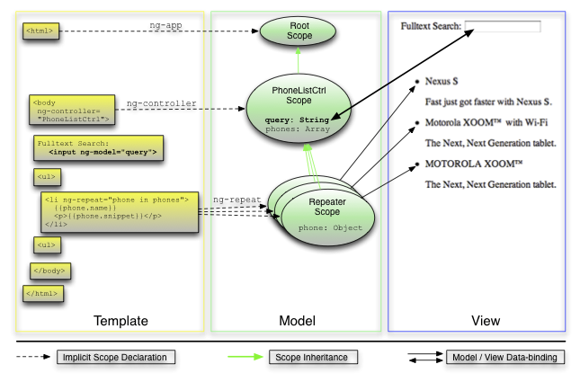

# 步骤3——过滤转换器
我们在上一步我们做了大量的工作，为后面打下了良好基础。所以现在我们可以简单的扩展就添加一个全文搜索的功能（是的，这很简单！）。我们也会写一个端到端（end-to-end,E2E）测试,因为良好的端到端测试是应用的好朋友，就像有一双眼睛时刻看着应用，快速定位故障。
* 程序会有一个搜索框。你需要注意在搜索框输入时电话列表的变化。

##工作区切换到步骤3
直接用浏览器访问[步骤3在线演示](http://angular.github.io/angular-phonecat/step-3/app)

大多数的重要改变都会列在下面，不过你也可以在[GitHub](https://github.com/angular/angular-phonecat/compare/step-2...step-3)看到完整的差异。


##控制器
这里我们没有修改控制器

##模板
`app/index.html`:
```html
  <div class="container-fluid">
    <div class="row">
      <div class="col-md-2">
        <!--工具条内容-->

        Search: <input ng-model="query">

      </div>
      <div class="col-md-10">
        <!--主体内容-->

        <ul class="phones">
          <li ng-repeat="phone in phones | filter:query">
            {{phone.name}}
            <p>{{phone.snippet}}</p>
          </li>
        </ul>

      </div>
    </div>
  </div>```
我们添加了一个标准的HTML`<input>`标签，并对ngRepeat指令应用了Angular的filter功能来处理`<input>`输入。

就是这些改变让用户输入搜索条件后马上可以在手机列表中看到对应的变化。这些新代码展示了：

* 数据绑定：这一Angular核心特性。当页面加载后，Angular把input标签定义的输入框的值绑定到一个命名变量中（页面中命名为query的变量），这个变量还以相同的名字存在于数据模型中，二者是完全同步的。在这个代码中输入框键入的内容（绑定到`query`）会立即作为列表输出时的过滤条件 (通过`phone in phones | filter:query` 这一句)。数据模型的变化导致转换器的输入改变,转换器通过更新DOM来反映模型的当前状态。

* 使用`filter`过滤器：`filter`功能使用`query`来创建一个新的数组（只有那些记录中匹配了`query`对应值），`ngRepeat`自动根据附加了`filter`变动的手机列表数据。这在开发过程中是完全透明的。

##测试
在步骤2中，我们学习了如何写单元测试。单元测试可以测试控制器和其他由JavaScript写的组件，但不能方便测试DOM操作或者我们写的程序本身。对此，端到端测试就是更好的选择。

这个搜索功能完全是通过模板和数据绑定来实施的，所以我们写出第1个端到端测试来验证这个工作。
`test/e2e/scenarios.js`:
```js
describe('PhoneCat App', function() {

  describe('Phone list view', function() {

    beforeEach(function() {
      browser.get('app/index.html');
    });


    it('根据用户在search输入框中的输入过滤手机列表', function() {

      var phoneList = element.all(by.repeater('phone in phones'));
      var query = element(by.model('query'));

      expect(phoneList.count()).toBe(3);

      query.sendKeys('nexus');
      expect(phoneList.count()).toBe(1);

      query.clear();
      query.sendKeys('motorola');
      expect(phoneList.count()).toBe(2);
    });
  });
});```
这个测试验证了搜索框和转换器很好的连接在一起工作。你可以看出在Angular中是多么容易的写出端到端测试啊。虽然这个例子展示的是一个简单测试，但它却是是十分容易设置功能的、且可读的端到端测试。

##利用Protractor运行端到端测试
尽管这些测试语句很像我们前面用Jasmine写的对控制器测试的语法，但端到端测试是使用的[Protractor](https://github.com/angular/protractor)提供的APIs。要想了解关于这些Protractor APIs的更多信息，可以阅读[ https://github.com/angular/protractor/blob/master/docs/api.md](https://github.com/angular/protractor/blob/master/docs/api.md)

我们用Protractor来完成端到端测试与采用Karma进行单元测试过程类似，尝试运行 `npm run protractor`。端到端测试比单元测试运行的速度要慢些。Protractor会在运行了一次端到端测试后自动退出，而不会自动的在测试区内文件变化时运行，为此，你必须在有变化后手动启动端到端测试，即再次运行`npm run protractor`。

>注意：你必须确认你已经打开了一个web服务来供protractor测试使用，你可以采用`npm start` （译者注：这时你有两个终端/命令行在运行，其中一个运行着`npm start`以提供web服务，另外一个执行着`npm run protractor`来进行端到端测试）。你还需要确认你已经安装了protractor 并且升级了webdriver使之符合运行`npm run protractor`的条件，这需要你之前执行过`npm install` 和 `npm run update-webdriver`

##尝试
###显示当前的查询条件
即在`index.html`中添加用`{{query}}`来显示当前`query`模型中当前值的模板设计，这可以观察到当输入框键入信息改变时最直接的变化。
###在标题中显示查询
让我们看看如何把`query`模型的值赋予HTML页面标题：
* 添加一个端到端测试到`test/e2e/scenarios.js`文件中`describe`部分：
```js
describe('PhoneCat App', function() {

    describe('Phone list view', function() {

      beforeEach(function() {
        browser.get('app/index.html');
      });

      var phoneList = element.all(by.repeater('phone in phones'));
      var query = element(by.model('query'));

      it('should filter the phone list as user types into the search box', function() {
        expect(phoneList.count()).toBe(3);

        query.sendKeys('nexus');
        expect(phoneList.count()).toBe(1);

        query.clear();
        query.sendKeys('motorola');
        expect(phoneList.count()).toBe(2);
      });

      it('should display the current filter value in the title bar', function() {
        query.clear();
        expect(browser.getTitle()).toMatch(/Google Phone Gallery:\s*$/);

        query.sendKeys('nexus');
        expect(browser.getTitle()).toMatch(/Google Phone Gallery: nexus$/);
      });
    });
  });```
   现在运行protractor（`npm run protractor`)肯定会看到失败信息。
* 你想该如何添加`{{query}}`到title标签，是不是应该像下面：
```html
<title>Google Phone Gallery: {{query}}</title>```
然而你直接刷新页面将不能看到期望的结果，这是因为"query"模型只存在于一定的作用范围(scope)内，这里是利用`ng-controller="PhoneListCtrl"命令定义在body元素内的：
```html
<body ng-controller="PhoneListCtrl">```
这意味着只有在body标签起效的区域（其本身和包括在内的子标签内）是query有效作用范围，之外则不是，而title标签是在这之外的。所以为了让这个数据模型在`<title>`内也有效，我们需要**移动/改变**`ngController`使得对整个HTML元素都有效（只有这个标签是同时包括了body和title的）：
```html
<html ng-app="phonecatApp"
ng-controller="PhoneListCtrl">```
并且确认已经把`ng-controller`从body标签中**移除**了。
* 再运行`npm run protractor`，这时你将看到测试通过的信息。
* 可能你注意到了因为angular的加载和初始化是需要时间的，你在浏览器标题栏中会在一瞬间看到如`Google Phone Gallery:{{query}}`这样的信息，但其实这不是你希望的（这时angular的数据绑定还没有起作用，就造成了前面的原始数据显示，和后面起作用后的正确显示），对此一个更好的处理方法是使用`ngBind`或者`ngBindTemplate`命令，这使得在加载器无关的信息对用户来说是不可见的：
```html
<title ng-bind-template="Google Phone Gallery: {{query}}">Google Phone Gallery</title>```
##小结
我们已经实现了文本搜索功能，还为该功能提供了测试，现在让我们进入步骤4，以给这个程序增添排序能力。


