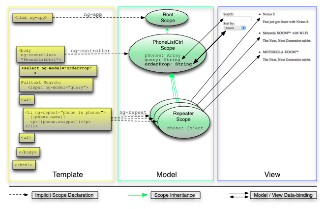

# 步骤4——双向数据绑定

在这一步骤中，我们将为程序添加一个特性使得可以对手机的显示排序。这还需要我们为手机数据模型中添加一些新信息作为排序的依据，并以此写出转换器的处理让数据起作用使得程序达到预期效果。
* 程序现在除了有一个搜索框还有一个下拉选择框，它允许选择数据排序的要求。

##工作区切换到步骤4
直接用浏览器访问[步骤4在线演示](http://angular.github.io/angular-phonecat/step-4/app)

大多数的重要改变都会列在下面，不过你也可以在[GitHub](https://github.com/angular/angular-phonecat/compare/step-3...step-4)看到完整的差异。

##模板
`app/index.html`:
```html
  Search: <input ng-model="query">
  Sort by:
  <select ng-model="orderProp">
    <option value="name">Alphabetical</option>
    <option value="age">Newest</option>
  </select>


  <ul class="phones">
    <li ng-repeat="phone in phones | filter:query | orderBy:orderProp">
      <span>{{phone.name}}</span>
      <p>{{phone.snippet}}</p>
    </li>
  </ul>
  ```
  这里只列出了在`index.html`模板中发生变化的部分，主要有：
* 首先，我们添加了一个`<select>`的html元素，并命名为`orderProp`，这样我们就有了两个排序依据选择了。

* 然后我们链接了经过`filter`转换器过滤后的数据作为`orderBy`转换器处理的输入。`orderBy`转换器会依据规则对输入的数据（数组）排序，即输出一个排序后的新数据（数组形式）。

在这里，Angular在`select`元素和`orderProp`数据模型间创建了一个双向数据绑定，然后orderProp被用于`orderBy`转换器（过滤器）。

正如我们在步骤3中看到的，因为这样的数据绑定使得任何的数据变化都可以及时的反映到输出结果中（这里是通过下拉菜单对排序条件的改变），而且这一过程中没有特别指定复杂的DOM操作处理（没有专门写这方面的代码）就自动实现了效果，这就是Angular数据绑定的威力所在。

##控制器
`app/js/controllers.js`:
```js
var phonecatApp = angular.module('phonecatApp', []);

phonecatApp.controller('PhoneListCtrl', function ($scope) {
  $scope.phones = [
    {'name': 'Nexus S',
     'snippet': 'Fast just got faster with Nexus S.',
     'age': 1},
    {'name': 'Motorola XOOM™ with Wi-Fi',
     'snippet': 'The Next, Next Generation tablet.',
     'age': 2},
    {'name': 'MOTOROLA XOOM™',
     'snippet': 'The Next, Next Generation tablet.',
     'age': 3}
  ];

  $scope.orderProp = 'age';
});
```
* 我们编辑了`phones`的数据模型，即手机数组，在这个结构对每条记录中增加了`age`元素项，其可用于按手机推出时间排序。
* 我们在控制器中设置了默认的值作为排序依据，即设置了`orderProp`的值为 `age`。如果不在这里设置这个值，则`orderBy`转换器（过滤器）是没有初始化的，直到我们在页面下拉菜单中进行了选择为止。

现在可以好好来谈谈双向数据绑定了。注意，当浏览器加载完成程序后下拉菜单的`Newest`项目是被选中的，这就是因为我们在控制器中设置了`orderProp`的排序依据是`age`，所以发生了数据模型向UI的绑定，现在我们在下拉菜单选择`Alphabetically`项，则数据模型马上会自动更新，让手机列表的排序依据要求发生变化，这时的数据绑定方向与前面恰好相反，是UI向数据模型的。

##测试
这里的改变需要单元测试和端到端测试两个方面内容，先来看看单元测试。
`test/unit/controllersSpec.js`:
```js
describe('PhoneCat controllers', function() {

  describe('PhoneListCtrl', function(){
    var scope, ctrl;

    beforeEach(module('phonecatApp'));

    beforeEach(inject(function($controller) {
      scope = {};
      ctrl = $controller('PhoneListCtrl', {$scope:scope});
    }));

    it('should create "phones" model with 3 phones', function() {
      expect(scope.phones.length).toBe(3);
    });


    it('should set the default value of orderProp model', function() {
      expect(scope.orderProp).toBe('age');
    });
  });
});
```
这个单元测试现在验证了默认排序的设置。

我们在`beforeEach`块内使用Jasmine的API来提取控制器内容，测试中这将在父级`describe`块内共享相关内容。

你现在应该能看到Karma输出类似下面信息：
```cmd
Chrome 22.0: Executed 2 of 2 SUCCESS (0.021 secs / 0.001 secs)
```

再看看端到端测试。
`test/e2e/scenarios.js`:
```js
...
    it('should be possible to control phone order via the drop down select box', function() {

      var phoneNameColumn = element.all(by.repeater('phone in phones').column('{{phone.name}}'));
      var query = element(by.model('query'));

      function getNames() {
        return phoneNameColumn.map(function(elm) {
          return elm.getText();
        });
      }

      query.sendKeys('tablet'); //let's narrow the dataset to make the test assertions shorter

      expect(getNames()).toEqual([
        "Motorola XOOM\u2122 with Wi-Fi",
        "MOTOROLA XOOM\u2122"
      ]);

      element(by.model('orderProp')).element(by.css('option[value="name"]')).click();

      expect(getNames()).toEqual([
        "MOTOROLA XOOM\u2122",
        "Motorola XOOM\u2122 with Wi-Fi"
      ]);
    });
  ...
```
这里端到端测试验证下拉菜单的选择是否正确。我们现在可以运行`npm run protractor`来看看运行情况。

##尝试
在`PhoneListCtrl`控制器中移除掉`orderProp`值的设置，你就会在Angular模板加载时看到下拉菜单会有一个"unknown"（显示为空白）项目，而且列表也会以“未排序/原始定义顺序”来排列。

在`index.html`模板添加一个`{{orderProp}}的绑定来显示当前的值。

反转排序只需要在排序值前面添加一个`-`号：
```html
<option value="-age">Oldest</option>
```

##小结
这一步我们为程序添加了排序功能，让我们进入步骤5，继续学习Angular的服务和依赖注入。
